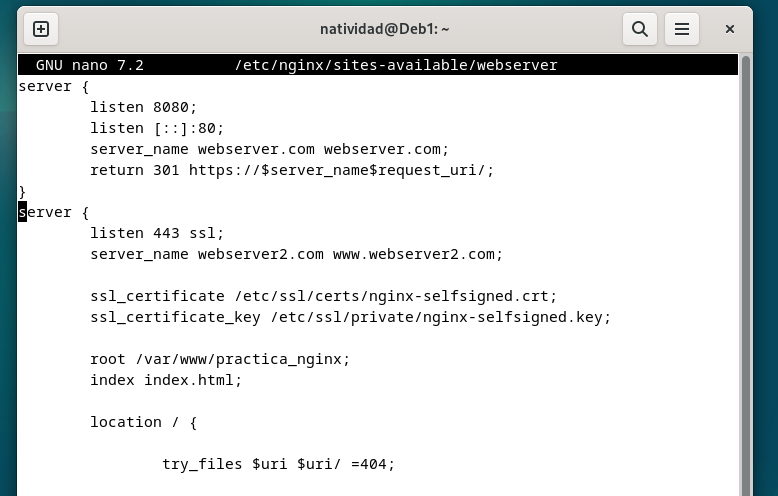
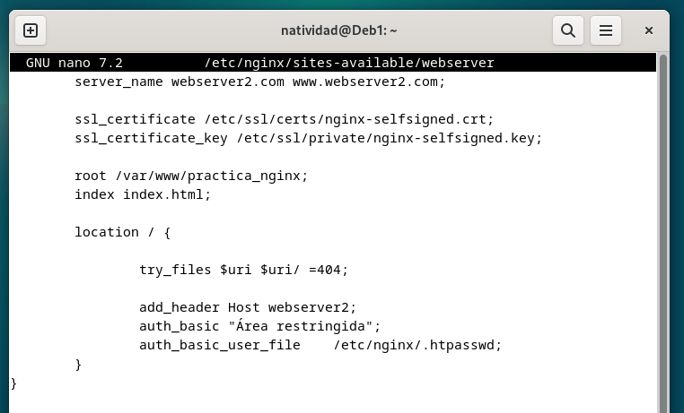
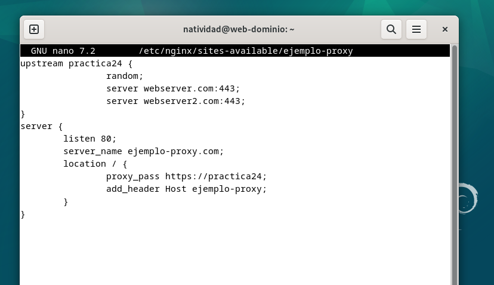
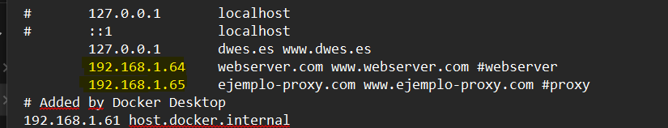
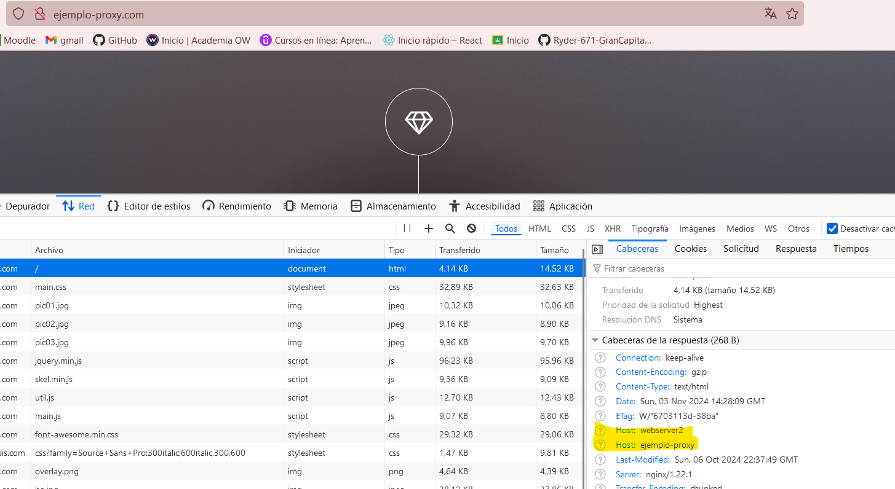
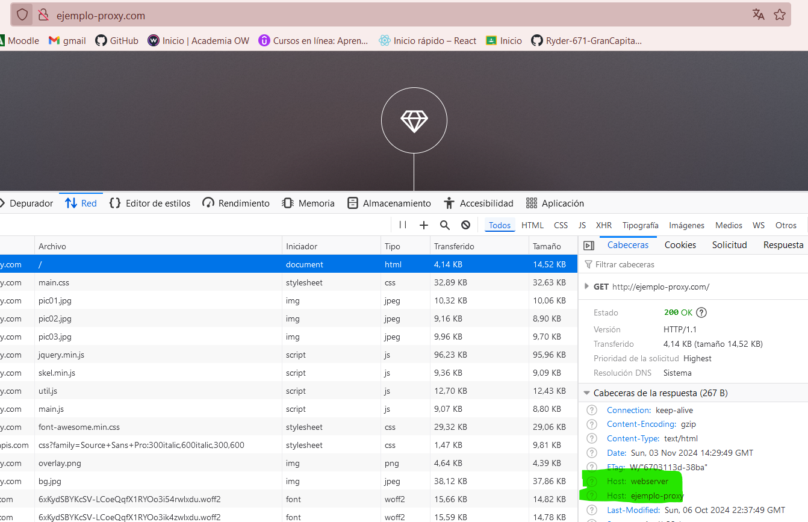

Natividad Márquez Baena

# Práctica 2.4 – Balanceo de carga con proxy inverso en Nginx

1. INTRODUCCIÓN
2. CONFIGURACIONES
3. COMPROBACIONES

## INTRODUCCIÓN
En esta practica se va a configurar y utilizar Nginx como proxy inverso y balanceador de carga en un entorno de servidores web, aprovechando sus capacidades para distribuir la carga de trabajo y gestionar las solicitudes de los clientes. 

Los servidores proxy inversos y los balanceadores de carga son intermediarios entre clientes y servidores en una arquitectura cliente-servidor, con el objetivo de mejorar la eficiencia de la comunicación.

Un proxy inverso recibe solicitudes de clientes, las reenvía al servidor adecuado y devuelve la respuesta, gestionando la comunicación y proporcionando una capa adicional de seguridad, y puede implementarse incluso con un solo servidor.

Un balanceador de carga, en cambio, distribuye las solicitudes entrantes entre múltiples servidores para optimizar el rendimiento y evitar sobrecargas. Es especialmente útil cuando el volumen de tráfico supera la capacidad de un solo servidor. Además, aumenta la fiabilidad al redirigir las solicitudes cuando un servidor falla, mejorando así la disponibilidad del sitio y la experiencia del usuario.

Para la realización de esta practica se ha clonado previamente la máquina virtual con el webserver, para obtener dos servidores que balanceen la carga.

## CONFIGURACIONES
En el clon de la maquina, se cambia la configuración del webserver a webserver 2. Para indicar que este será el otro servidor web. Se modifica el `server_name` por webserver2. 

También se modifica el `header`.

Ya disponemos de los dos servidores web entre los que se van a repartir las peticiones al servidor, se procede a modificar el proxy inverso, para que realice este reparto de peticiones:

En el archivo de configuración del proxy se modifica la configuración. Se añade un bloque llamado `upstream`, que son los bloques donde se repartirán la carga, en el siguiente formato:

De esta manera hemos indicado que se repartirán entre el webserver1 y el webserver2.

Para cada cambio en los archivos de configuración, tanto de los servidores web como del proxy, se ha de restaurar nginx para aplicar los cambios:

También realizamos una comprobación del archivo hosts de la máquina anfitriona, para comprobar que la IP es correcta.

## COMPROBACIONES
En este apartado se va a comprobar si la sobrecarga con multiples solicitudes al servidor, desencadena un balanceo al otro servidor web.

Primeramente se comprueba el acceso a nuestro sitio web:

La cabecera Host: webserver2 indica que la solicitud fue dirigida a `webserver2`.

Si sometemos al sitio web a una "sobrecarga" presionando F5 repetidamente, el balanceo provocaría un cambio de la recepción de las solicitudes, al otro servidor web.

Como se observa en la imagen, marcado en verde, la cabecera ha cambiado a `webserver1`. 
De esta manera hemos comprobado que el balanceo de la carga entre los dos servidores funciona correctamente.
